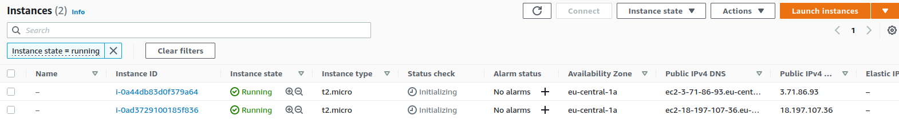

# Terraform Best Practices
[](https://opensource.org/licenses/MIT)
[](https://github.com/R3DRUN3/terraform-best-practices/actions/workflows/CI.yml)

Learn Terraform Best Practice 🤖 ⚙️ 🔧

<p align="center"></p>

## Abstract
This repo is inspired by this youtube video: https://www.youtube.com/watch?v=gxPykhPxRW0
<br>
it is therefore recommended to display it as an accompaniment to the contents of the repo.
<br>
<br>
Some of Terraform best practice are:

- Always put variables in the variables.tf file
- Manipulate state only through Terraform commands
- Save Terraform state to remote location (in this case AWS S3 Bucket)
- Lock remote Terraform state to avoid concurrent access to the infrastructure.
- Back up State File
- Use 1 State per Environment
- Host Terraform code in Git repository
- Never save Terraform state files in GIT repository
- Execute Terraform only in an automated CI/CD build

<br>

In this repo we try to follow all these best practices.


## Prerequisites
The code in this repo has been tested on `Ubuntu 22.04` host with:

- `Terraform v1.2.4`

## Instructions
Clone this repo and launch the aws provisioning for creating the remote Backend that will host Terraform state file (S3 Bucket + DynamoDb table for avoiding concurrent access):

```console
git clone https://github.com/R3DRUN3/terraform-best-practices.git \
&& cd terraform-best-practices/backend-prerequisites \
&& terraform init && terraform apply
```

Once this deployment has ended, you will find an S3 Bucket and a DynamoDB table on your aws account:

S3:
<p align="left">
  
</p>

DynamoDB:
<p align="left">
  
</p>

These two entities will provide the basis for implementing a backend that will allows us to save the state of our IaC, while also preventing two or more developers from launching commands against it at the same time.

Now that we have a decentalized state, we can proceed by launching the demo that can be found in the `terraform-demo-with-backend` folder.
This will create for us two aws EC2 instances and will write changes to the `terraform.tfstate` file in our aws.

Ath the end of the procedure you should see your instances in the EC2 dashboard:

<p align="left">
  
</p>

At this point, if you check your S3 Bucket, you will see that the size has incresed to make room for Terraform state:

<p align="left">
  
</p>

Note that the best practice is to always execute Terraform scripts via an automated build, this is the reason why you will find a github action workflow associated with this repo, this automatically execute the scripts in `terraform-demo-with-backend` on push.

